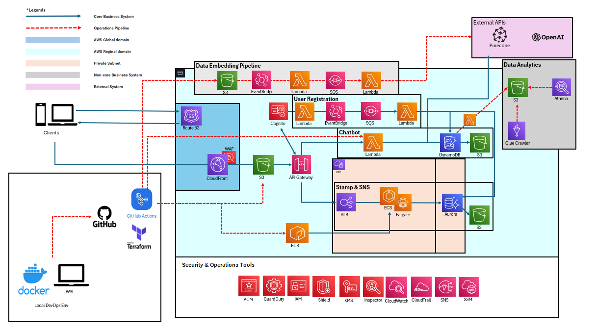

Shotrip
**A Location-Specific Tourism Media Platform for Japan**

### 1. Vision: Bridging the "Information Asymmetry" in Tourism
By the age of 22, I conquered all 47 prefectures in Japan and visited over 20 countries. This journey revealed a harsh reality: world-famous destinations are becoming overcrowded and suffocating, while incredibly charming rural areas are fading away unnoticed. This is the "Information Asymmetry" caused by modern SNS algorithms that prioritize shallow, viral impressions over authentic value.

I built **Shotrip** to fix this. By leveraging my extensive travel experience, cloud engineering (AWS), and linguistic skills (English/French/Japanese), I created a 24/7 AI-driven guide to help inbound travelers find their "own favorite spots." My goal is to re-map tourist flows, enabling travelers to enjoy Japan without the fear of overtourism while revitalizing local economies through authentic discovery.

### 2. Architecture

*Full-stack deployment via a single `git push` (IaC with Terraform & CI/CD with GitHub Actions).*

### 3. Engineering Strategy & Trade-offs
Decision-making focused on the July 2026 release and business viability.

* **Pay-as-you-go Efficiency**:Prioritized serverless architecture to minimize operational costs while maintaining high scalability.
* **Performance via SSG**:Eschewed SSR in favor of SSG (S3 + CloudFront) to achieve superior SEO performance and zero-server maintenance.
* **Pragmatic Containerization**:Integrated ECS Fargate for specific app components to balance modern container orchestration with serverless simplicity.
* **Relational Data Integrity**:Selected Aurora for features requiring complex relations (e.g., Stamp Rally/Quiz), ensuring data consistency.
* **Risk-Based Security**:Utilized IAM authentication for Aurora access; deliberately skipped unnecessary environment variable encryption where IAM roles already ensure secure access.
* **Cost-Priority Availability**:Adopted a Single-AZ configuration for non-core features to optimize the budget without sacrificing core business logic.

### 4. Current Status & Roadmap
*Recognized gaps being recognized:*
* **RAG Precision**:Continuous tuning of embedding logic and prompt engineering.
* **Security Ops**:Some WAF rules are currently managed manually for real-time adjustment.
* **IAM Permissions**:Utilizing provisional roles for rapid development; least-privilege refactoring planned for production.
* **Documentation**:Ongoing reverse-documentation and in-code commenting.

---

## 日本語 / Japanese

### 1. ビジョン: 「情報の非対称性」を排除し、観光の再マッピングをする
私は22歳までに47都道府県を制覇し、20カ国以上の海外を歩いてきました。その中で目の当たりにしたのは、「有名な観光地が人混みで窮屈な空間と化す一方で、素晴らしい魅力を持つ地方が誰にも知られず衰退していく」という残酷なまでの情報の非対称性です。

現代のSNS・アルゴリズム特有の「表層的な情報の集中」が、このオーバーツーリズムの正体だと考えています。

本プラットフォーム "Shotrip" は、私の旅の全経験とエンジニアリング、そして語学（日英仏）を掛け合わせ、24時間365日、訪日外国人に「自分だけのお気に入り」を案内するために構築しました。画一的な情報ではない「価値ある選択肢」を提示することで人の流れを再マッピングし、観光客がオーバーツーリズムを恐れず、地方がその価値で潤う社会を目指しています。

### 2. 構成図
(上記画像参照)

### 3. 技術選定とトレードオフ
* **コスト最適化**: サーバーレスを主軸にPay-as-you-goで構築。
* **高速化**: S3+CloudFront（SSG）による静的配信。
* **コンテナ活用**: 技術習得と拡張性のために一部ECSを採用。
* **データ構造**: リレーショナルな操作が必要な機能にはAuroraを採択。
* **意思決定の優先順位**: ビジネスゴールに基づき、技術的根拠のある簡略化（IAM認証活用等）を採択。
* **シングルAZ**: 現状のビジネス優先度に基づき、付随機能はコスト優先で構成。

### 4. ステータス
リリースに向け、RAG精度向上やセキュリティ運用、権限管理の最適化を順次実施予定。